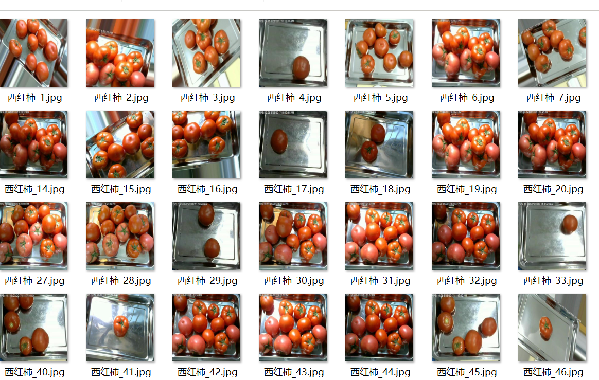
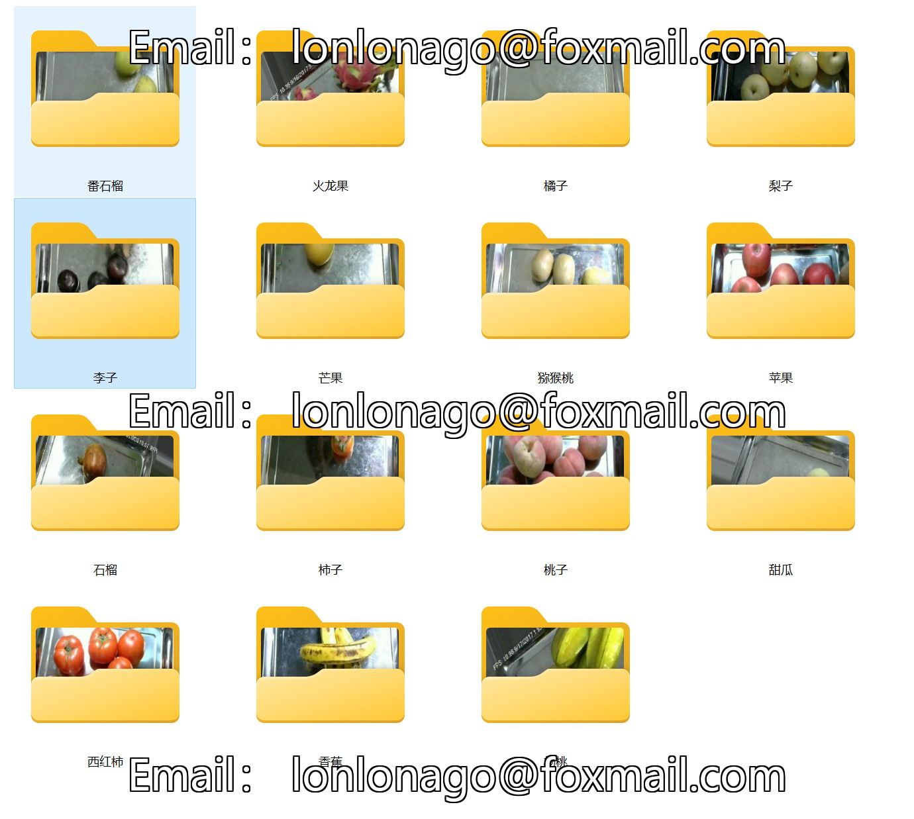

# 15 Types of Common Fruits Image Classification Dataset

Dataset Information Introduction:
- Number of images in the folder "Peach": 800
- Number of images in the folder "Dragon Fruit": 800
- Number of images in the folder "Strawberry": 800
- Number of images in the folder "Watermelon": 800
- Number of images in the folder "Guava": 800
- Number of images in the folder "Longan": 800
- Number of images in the folder "Kiwi": 800
- Number of images in the folder "Melon": 800
- Number of images in the folder "Grape": 800
- Number of images in the folder "Orange": 800
- Number of images in the folder "Banana": 800
- Total number of images in all subfolders: 12000

Screenshot:

## Images

Here is a pay link on Stripe ( https://buy.stripe.com/3cs8yP7sY87d0vu9AB ). Please contact me lonlonago@foxmail.com after funding $89, and I will send you a complete data files , thank you!

